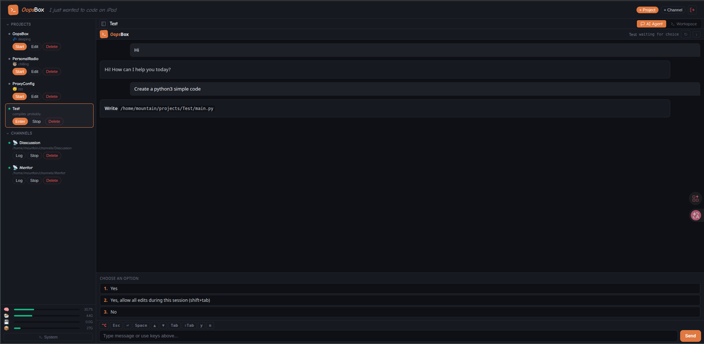
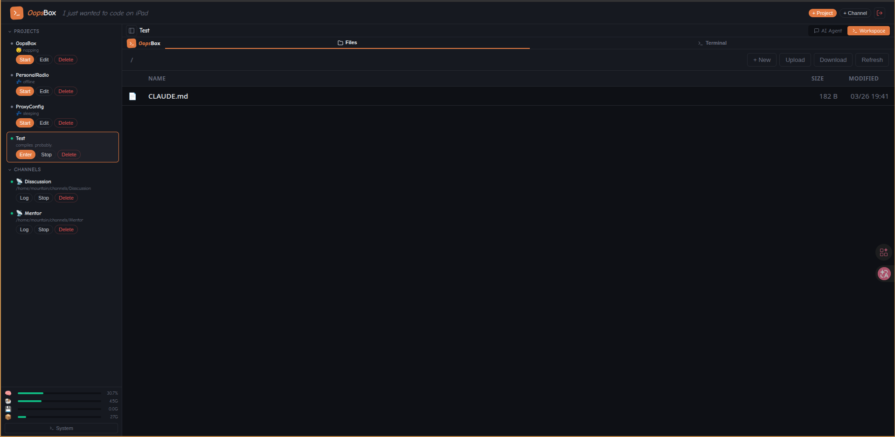
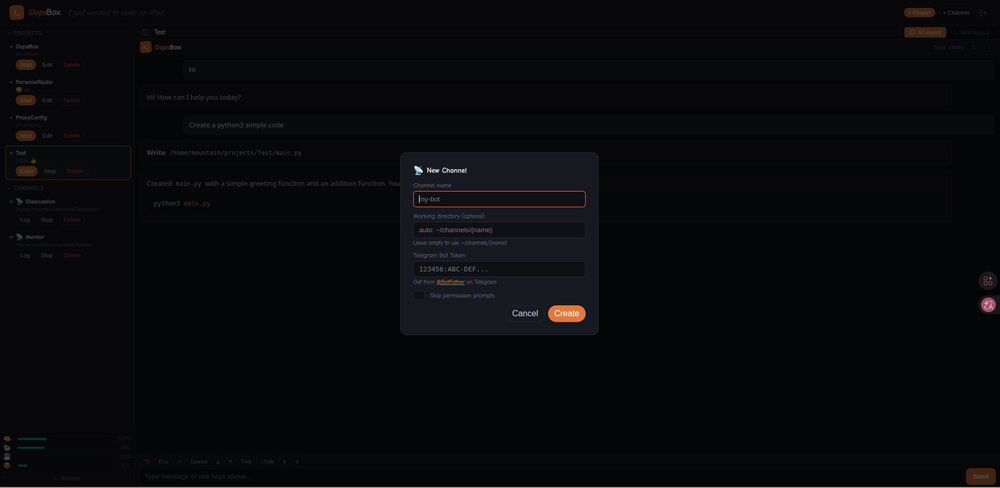
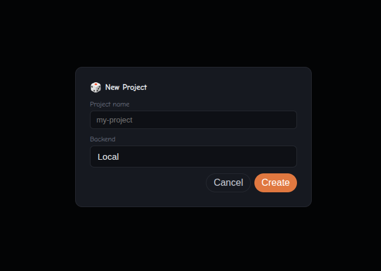
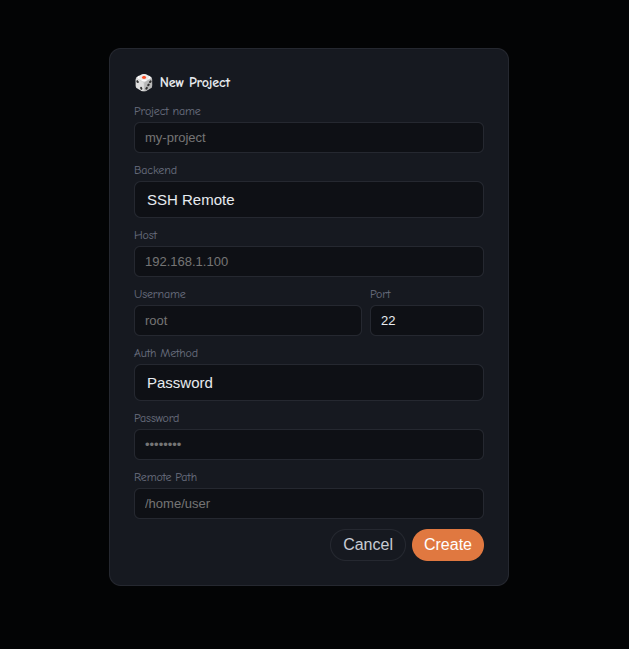
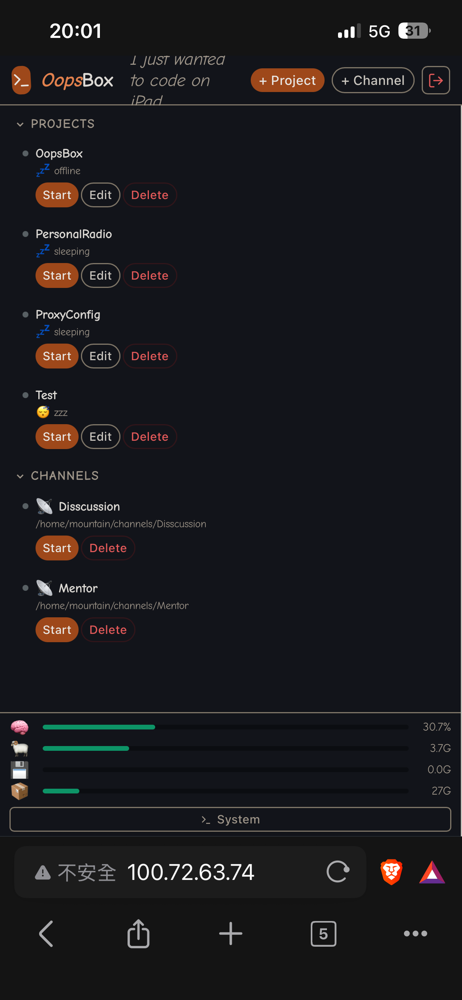
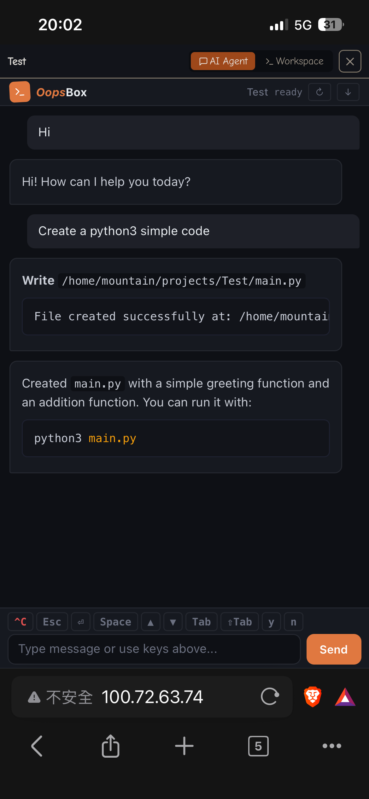
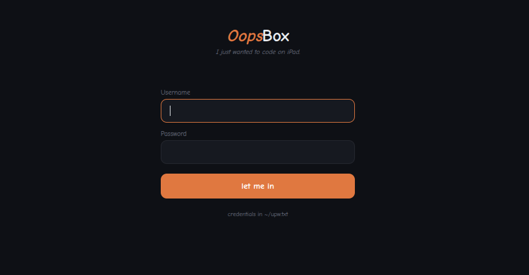

# >_ OopsBox

[English](#english) | [繁體中文](#繁體中文)

<p align="center">
  
</p>

<p align="center">
  <em>I just wanted to code on iPad. Now there's a whole platform. oops.</em><br>
  <em>我只是想在 iPad 上寫 code。然後它就失控了。oops。</em>
</p>

<p align="center">
  <strong>⚠️ Permanently under construction. I keep saying "just one more feature" and it keeps being a lie. Nothing is stable, everything is on fire, and somehow it still works. Use at your own risk — I do, and I'm not sure that's a recommendation.</strong><br><br>
  <strong>⚠️ 永久施工中。我一直說「就再加一個功能」然後每次都是謊話。沒有東西是穩定的，到處都在著火，但它不知怎麼還能跑。使用風險自負 — 我自己每天都在用，但我不確定這算不算推薦。</strong>
</p>

---

## English

I just wanted to code on iPad.

Somehow I ended up building a whole web-based dev platform. It runs AI coding agents, manages SSH connections, edits files, monitors your server — all from a browser. On an iPad. On a bus. Sometimes from Telegram because I have no self-control.

It wasn't planned. It just... happened. And it refuses to stop growing. I've tried to stop adding features. I failed. Multiple times. The Telegram integration was supposed to be a joke.

### what even is this

A web dashboard that lets you run AI coding agents (Claude Code, Codex, whatever) on a remote server and control everything from your iPad, phone, or any browser. You get a terminal with actual control key buttons (because try typing Ctrl+C on an iPad keyboard, I dare you), a file manager, an AI agent chat with interactive prompts, a code editor that doesn't choke on large files, Telegram bot integration, encrypted token storage, and system monitoring — because once you start adding features, the project develops a mind of its own.

Think of it as a side project that ate my weekends and became sentient. It now has crash recovery, auto-restart loops, and session persistence. It's harder to kill than I'd like to admit.

### screenshots

| AI Agent Chat | File Manager |
|:---:|:---:|
|  |  |

| Terminal | Channel Setup |
|:---:|:---:|
|  |  |

| Create Project (Local) | Create Project (SSH Remote) |
|:---:|:---:|
|  |  |

| Mobile Dashboard | Mobile AI Agent |
|:---:|:---:|
|  |  |

| Login |
|:---:|
|  |

### the accidental feature list

- **AI Agent chat** — talk to your coding agent without fighting with terminal IME on iPad. auto-restart loop keeps it running even when you accidentally Ctrl+C it. interactive yes/no and checkbox prompts rendered as clickable buttons — because parsing tmux output with your eyeballs at 2am is a skill I no longer want. session persistence via `--resume` so your conversation survives reboots, crashes, and your questionable life choices.
- **Web terminal** — ttyd + tmux, with actual ^C, ^D, ^Z, ^L, Tab, and arrow buttons in the toolbar. because Apple thinks iPad users don't need a proper terminal. per-project sessions that auto-respawn when you inevitably Ctrl+D yourself out. the terminal is now harder to kill than a cockroach.
- **Workspace** — file manager + terminal in tab view. the file manager finally grew up and learned how to be a real file manager. right-click context menus, multi-select with checkboxes (Ctrl+click, Shift+click, the whole civilized experience), drag-and-drop upload with progress bars, rename, delete, new folder, copy/cut/paste, column sorting, search — basically everything FileZilla does minus the FTP part and plus the existential dread of building it myself. single-click selects, double-click opens, because I finally stopped pretending that "click to open" was acceptable UX. oh and there's a batch action bar now. select 47 files and delete them all at once. power.
- **Code editor** — syntax highlighting, Markdown preview with Mermaid, file upload/download, image preview. sliding window for large files so your browser doesn't file a restraining order. the whole thing got refactored from a 760-line single-file nightmare into proper ES modules because even I have standards (low ones, but they exist).
- **Skills panel** — the AI Agent page now has a ⚡ Skills button that shows all installed Claude Code plugins and skills. filter them, see which ones you can invoke vs which ones the AI triggers automatically. click one to insert it into the input box. I added this because I kept forgetting what skills I installed, which is the software equivalent of buying groceries you already have at home.
- **Telegram Channels** — connect Claude Code to Telegram via `--channels`. your AI agent becomes a Telegram bot. tokens encrypted with AES-256-CBC because storing API keys in plaintext is how you end up on Hacker News for the wrong reasons. channels auto-start on boot because I got tired of manually starting them every time the server decided to take a nap.
- **Docker deployment** — `docker run -p 8080:80 oopsbox` and you're done. the whole platform in one container, managed by s6-overlay because apparently I now have opinions about process supervisors. pass your API key via `-e ANTHROPIC_API_KEY`, set a password with `-e OOPSBOX_PASSWORD`, mount some volumes for persistence, and pretend you planned this all along.
- **SSH remote projects** — your agent runs here, executes commands over there. editor uses SFTP. it works better than it should, which frankly makes me nervous.
- **System monitor** — CPU, RAM, swap, disk — because watching CPU go brrr while your AI agent rewrites your codebase is the modern equivalent of watching a campfire.
- **Crash recovery** — dashboard auto-restarts via systemd (`Restart=always`, because `on-failure` was too optimistic). terminals respawn on exit. Claude agents auto-resume sessions. this thing is basically a zombie — you can kill it but it keeps coming back.
- **Login auth** — hashed password storage, session tokens, HTTP-only cookies. the bare minimum to keep random people from using your AI agents to mine crypto or whatever.
- **Idle auto-shutdown** — projects idle for 2 hours get stopped automatically. channels are exempt because Telegram bots don't believe in sleep.
- **PWA support** — add to home screen for an app-like experience. now with a proper icon instead of a Minecraft chest. we're growing up.
- **Responsive** — works on phone, iPad, desktop. clamp() everywhere. the CSS is a war crime but it renders correctly and I will not apologize.

### quick start

You have two options. pick your poison.

#### Option A: Docker (recommended, because why install things when containers exist)

```bash
docker run -d \
  --name oopsbox \
  -p 8080:80 \
  -e OOPSBOX_PASSWORD=yourpassword \
  -e ANTHROPIC_API_KEY=sk-ant-... \
  -e GIT_NAME="Your Name" \
  -e GIT_EMAIL="you@example.com" \
  -v oopsbox-projects:/oopsbox/projects \
  -v oopsbox-config:/oopsbox/.config/oopsbox \
  -v oopsbox-claude:/oopsbox/.claude \
  -v oopsbox-channels:/oopsbox/channels \
  oopsbox
```

That's it. Open `http://localhost:8080/` and oops, you have a platform.

If you skip `OOPSBOX_PASSWORD`, it generates a random one and prints it to the container logs — check `docker logs oopsbox` to find it. This is either a security feature or laziness. Both.

| Environment Variable | Required | Description |
|---|---|---|
| `OOPSBOX_PASSWORD` | No (auto-generated) | Dashboard login password |
| `OOPSBOX_USERNAME` | No (default: `admin`) | Dashboard login username |
| `ANTHROPIC_API_KEY` | No (not needed for Claude Max) | Anthropic API key |
| `GIT_NAME` | No | Git author name |
| `GIT_EMAIL` | No | Git author email |

| Volume | Container Path | What it stores |
|---|---|---|
| `oopsbox-projects` | `/oopsbox/projects` | Your project files and registries |
| `oopsbox-config` | `/oopsbox/.config/oopsbox` | Auth, encryption keys |
| `oopsbox-claude` | `/oopsbox/.claude` | Claude CLI sessions and settings |
| `oopsbox-channels` | `/oopsbox/channels` | Telegram channel data |

#### Option B: Bare metal (for people who like to live dangerously)

```bash
git clone https://github.com/MountainShan/OopsBox.git
cd OopsBox
./install.sh
```

The installer sets up credentials, git config, systemd services, nginx, and everything else. It asks you two questions (username/password and git config), installs a bunch of packages, and then pretends it was your idea all along.

Then open `http://<your-ip>/` and oops, you have a platform.

##### you'll need

- Ubuntu 24.04 (probably works on other things, haven't tried, prayers optional)
- Python 3.12+
- An AI coding agent CLI (Claude Code, Codex, etc.)
- An API key or subscription for said agent

##### what it installs

```
System:  tmux, ttyd, nginx, jq, sshpass, git
Python:  fastapi, uvicorn, paramiko, python-multipart, aiofiles
```

#### tested on

**Server:**

| Environment | Status |
|---|---|
| Ubuntu 24.04 LTS (x86_64) | ✅ works |
| Debian 12 | 🤷 probably works |
| Proxmox VM | ✅ works |
| Bare metal | ✅ works |
| Docker | ✅ works (finally, it only took forever) |
| LXC | 🤷 untested |

**Client:**

| Device / Browser | Status |
|---|---|
| iPad Safari | ✅ works (the whole point) |
| iPhone Safari | ✅ mostly works |
| Chrome | ✅ works |
| Firefox | ✅ works |

### how it works (roughly)

```
browser → nginx → FastAPI dashboard
                → ttyd terminals (per project, each backed by tmux)
                → system terminal

all AI agents share one tmux session ("agents"):
  agents session
  ├── system window (system agent via claude-loop.sh)
  ├── project-name window (per-project agent)
  └── chan-name window (per-channel agent)

session recovery:
  claude-loop.sh uses --resume <session-id> to persist conversations
  sessions resumed by name from ~/.claude/sessions/*.json
  terminals use tmux remain-on-exit + respawn hooks
  dashboard uses systemd Restart=always
  basically everything auto-heals. it's like wolverine but uglier.
```

The AI Agent tab reads Claude's JSONL session files and renders messages in a chat bubble UI with markdown and syntax highlighting. Interactive prompts (yes/no, numbered choices, checkboxes) become clickable buttons. The Workspace tab has a file manager and terminal you can switch between. Click a file → modal editor opens. Done editing → close it. No tabs, no complexity, no existential crisis.

### project types

**Local** — agent runs on the box, has full access, does its thing.

**SSH** — connects to a remote server. agent stays here, runs commands over SSH. CLAUDE.md tells it how. editor uses SFTP. supports password and key auth. it works better than it should.

### channels (didn't know what to build, seemed useful, so I built it)

I didn't really know what to build next. Then I thought — what if my AI agent could talk to me on Telegram? Seemed useful. So I built it. Now your Claude Code instance becomes a Telegram bot. You chat with it on Telegram, it codes on your server. From the dashboard, click `+ Channel`, paste your BotFather token (stored encrypted, you're welcome), and start it. Claude auto-configures the Telegram plugin, you pair with a code, and somehow you're now coding from Telegram on a bus. I'm not sure if this is innovation or a cry for help.

The channel runs with `--dangerously-skip-permissions` because there's no UI to click "allow" on Telegram. Yes, it's called "dangerously" for a reason. No, I don't want to talk about it. Channels auto-start on boot and are immune to idle shutdown because bots don't need work-life balance.

### FAQ

**Q: Is this production ready?**
A: this question implies I had a plan. I did not.

**Q: Should I use this?**
A: I use it daily, which is either a recommendation or a warning depending on your risk tolerance.

**Q: Why did you build this?**
A: I wanted to type `ls` on my iPad without wanting to throw it across the room. Somehow that turned into encrypted Telegram bots with AES-256-CBC and auto-healing tmux sessions.

**Q: Why does the UI say "somehow alive"?**
A: because between the auto-restarts, crash recovery, and session persistence, I'm genuinely surprised it's still running. every day it boots is a small miracle.

**Q: What's the icon?**
A: a terminal prompt on an orange square. we upgraded from the Minecraft chest. character development.

**Q: Can I code from Telegram now?**
A: yes. I'm sorry. I'm so sorry.

**Q: What's next?**
A: I don't know and I'm scared to find out. last time I said "just one more feature" I ended up with encrypted token storage and systemd crash recovery.

### license

MIT — do whatever you want with it. if it breaks, that's on you. I just wanted to code on iPad, and now I have a platform with auto-healing terminals and encrypted Telegram bots. send help.

---

## 繁體中文

我只是想在 iPad 上寫 code。

結果意外地做出了一整個網頁開發平台。可以跑 AI coding agent、管 SSH 連線、編輯檔案、監控伺服器 — 全部在瀏覽器裡搞定。有時候還用 Telegram 寫 code，因為我顯然沒有自制力。

這不在計劃中。就是... 莫名其妙變成這樣了。我試過停止加功能。我失敗了。很多次。Telegram 整合本來只是開玩笑的。

### 這到底是什麼

一個網頁 dashboard，讓你在遠端 server 上跑 AI coding agent（Claude Code、Codex 之類的），然後用 iPad、手機或任何瀏覽器操控它。Terminal 有實體控制鍵按鈕（因為你在 iPad 鍵盤上試試按 Ctrl+C 看看），檔案管理器、AI agent 對話介面有互動按鈕、code editor 大檔案不會卡、Telegram bot 整合、加密 token 儲存，還有系統監控 — 因為一旦開始加功能，專案就會自己長出腦子。

就當作一個吃掉我所有週末的副專案，然後它變成了有自我意識的東西。它現在有 crash recovery、自動重啟、session 持久化。比我願意承認的還難殺死。

### 截圖

| AI Agent 對話 | 檔案管理器 |
|:---:|:---:|
|  |  |

| Terminal | Channel 設定 |
|:---:|:---:|
|  |  |

| 建立專案（Local） | 建立專案（SSH Remote） |
|:---:|:---:|
|  |  |

| 手機版 Dashboard | 手機版 AI Agent |
|:---:|:---:|
|  |  |

| 登入 |
|:---:|
|  |

### 意外產生的功能

- **AI Agent 對話** — 在 iPad 上跟你的 coding agent 講話，不用跟 terminal 的輸入法打架。自動重啟循環讓它一直跑，就算你不小心 Ctrl+C 也沒關係。互動式 yes/no 和 checkbox 直接渲染成可點擊的按鈕 — 因為凌晨兩點用肉眼在 tmux 裡解析文字是我不再想擁有的技能。Session 用 `--resume` 保持連續性，你的對話能撐過重開機、crash、以及你那些令人質疑的人生決定。
- **Web terminal** — ttyd + tmux，toolbar 上有 ^C、^D、^Z、^L、Tab 和方向鍵按鈕。因為 Apple 覺得 iPad 使用者不需要真正的 terminal。每個專案獨立 session，shell 退出會自動重生。這個 terminal 現在比蟑螂還難殺。
- **Workspace** — 檔案管理器 + terminal 用 tab 切換。檔案管理器終於長大了，學會當一個真正的檔案管理器。右鍵選單、checkbox 多選（Ctrl+點、Shift+點，整套文明人的體驗）、拖放上傳帶進度條、重新命名、刪除、新資料夾、複製/剪下/貼上、欄位排序、搜尋 — 基本上 FileZilla 能做的都做了，少了 FTP 多了自己從零造輪子的存在危機。單擊選取、雙擊開啟，因為我終於不再假裝「點一下就開啟」是可接受的 UX 了。對了現在還有批次操作列，選 47 個檔案一次全刪。權力的感覺。
- **Code editor** — 語法高亮、Markdown 預覽支援 Mermaid、檔案上傳下載、圖片預覽。大檔案用滑動視窗，讓你的瀏覽器不會申請保護令。整個東西從 760 行的單檔噩夢重構成正經的 ES modules，因為就連我也有標準（很低，但它存在）。
- **Skills 面板** — AI Agent 頁面現在有一個 ⚡ Skills 按鈕，顯示所有已安裝的 Claude Code 插件和技能。可以過濾、看哪些是你能手動呼叫的、哪些是 AI 自動觸發的。點一下就插入輸入框。我加這個功能是因為我一直忘記自己裝了什麼 skill，這在軟體世界裡等同於買了家裡已經有的菜。
- **Telegram Channels** — 透過 `--channels` 把 Claude Code 接上 Telegram。Token 用 AES-256-CBC 加密，因為明碼存 API key 就是你上 Hacker News 頭版但原因是壞的那種。Channel 開機自動啟動，因為我受夠了每次 server 打盹就要手動開。
- **Docker 部署** — `docker run -p 8080:80 oopsbox` 搞定。整個平台塞在一個 container 裡，用 s6-overlay 管理，因為我現在居然對 process supervisor 有意見了。用 `-e ANTHROPIC_API_KEY` 傳 API key，用 `-e OOPSBOX_PASSWORD` 設密碼，掛幾個 volume 做持久化，然後假裝這一切都是計劃好的。
- **SSH 遠端專案** — agent 在這台跑，指令在那台執行。editor 用 SFTP。支援密碼和金鑰認證。它運作得比它應該有的還好，這讓我很緊張。
- **系統監控** — CPU、RAM、swap、磁碟 — 因為看 AI agent 重寫你的 codebase 時 CPU 跑起來，是現代版的看營火。
- **Crash recovery** — Dashboard 用 systemd 自動重啟（`Restart=always`，因為 `on-failure` 太樂觀了）。Terminal 退出會重生。Claude agent 自動恢復 session。這東西基本上是殭屍 — 你殺得死它但它會一直回來。
- **登入驗證** — 雜湊密碼儲存、session token、HTTP-only cookies。最基本的防護，讓路人甲不要用你的 AI agent 去挖礦還是幹嘛的。
- **閒置自動停止** — 閒置超過 2 小時的專案會自動停止。Channel 不受影響，因為 Telegram bot 不相信睡眠這種事。
- **PWA 支援** — 加到主畫面，像 app 一樣使用。現在有正經的 icon 了，不再是 Minecraft 箱子。我們在成長。
- **自適應介面** — 手機、iPad、桌機都行。到處都是 clamp()。CSS 是一場戰爭犯罪但它正確渲染了，我不會道歉。

### 快速開始

兩種方式，選一個。

#### 方法 A：Docker（推薦，因為有 container 幹嘛還要手動裝）

```bash
docker run -d \
  --name oopsbox \
  -p 8080:80 \
  -e OOPSBOX_PASSWORD=你的密碼 \
  -e ANTHROPIC_API_KEY=sk-ant-... \
  -e GIT_NAME="你的名字" \
  -e GIT_EMAIL="you@example.com" \
  -v oopsbox-projects:/oopsbox/projects \
  -v oopsbox-config:/oopsbox/.config/oopsbox \
  -v oopsbox-claude:/oopsbox/.claude \
  -v oopsbox-channels:/oopsbox/channels \
  oopsbox
```

就這樣。打開 `http://localhost:8080/`，oops，你有一個平台了。

如果沒設 `OOPSBOX_PASSWORD`，它會自動產生一個隨機密碼然後印在 container log 裡 — 用 `docker logs oopsbox` 看。這是安全功能還是偷懶。兩者都是。

| 環境變數 | 必填 | 說明 |
|---|---|---|
| `OOPSBOX_PASSWORD` | 否（自動產生） | Dashboard 登入密碼 |
| `OOPSBOX_USERNAME` | 否（預設：`admin`） | Dashboard 登入帳號 |
| `ANTHROPIC_API_KEY` | 否（Claude Max 不需要） | Anthropic API key |
| `GIT_NAME` | 否 | Git 作者名稱 |
| `GIT_EMAIL` | 否 | Git 作者信箱 |

| Volume | 容器路徑 | 存什麼 |
|---|---|---|
| `oopsbox-projects` | `/oopsbox/projects` | 你的專案檔案和 registry |
| `oopsbox-config` | `/oopsbox/.config/oopsbox` | 認證、加密金鑰 |
| `oopsbox-claude` | `/oopsbox/.claude` | Claude CLI session 和設定 |
| `oopsbox-channels` | `/oopsbox/channels` | Telegram channel 資料 |

#### 方法 B：裸機安裝（給喜歡危險生活的人）

```bash
git clone https://github.com/MountainShan/OopsBox.git
cd OopsBox
./install.sh
```

安裝程式會問你兩個問題（帳密和 git 設定），裝一堆套件，然後假裝這一切都是你的主意。

然後打開 `http://<你的IP>/`，oops，你有一個平台了。

##### 你需要

- Ubuntu 24.04（其他的大概也行，沒試過，祈禱可選）
- Python 3.12+
- 一個 AI coding agent CLI（Claude Code、Codex 等）
- 對應的 API key 或訂閱

##### 會裝什麼

```
系統套件：tmux, ttyd, nginx, jq, sshpass, git
Python：  fastapi, uvicorn, paramiko, python-multipart, aiofiles
```

#### 測試過的平台

**Server：**

| 環境 | 狀態 |
|---|---|
| Ubuntu 24.04 LTS (x86_64) | ✅ 能用 |
| Debian 12 | 🤷 大概能用 |
| Proxmox VM | ✅ 能用 |
| 實體機 | ✅ 能用 |
| Docker | ✅ 能用（終於，只花了一輩子） |
| LXC | 🤷 沒測過 |

**Client：**

| 裝置 / 瀏覽器 | 狀態 |
|---|---|
| iPad Safari | ✅ 能用（重點就是這個） |
| iPhone Safari | ✅ 大致能用 |
| Chrome | ✅ 能用 |
| Firefox | ✅ 能用 |

### 大概怎麼運作的

```
瀏覽器 → nginx → FastAPI dashboard
               → ttyd terminal（每個專案一個，各自有 tmux session）
               → 系統 terminal

所有 AI agent 共用一個 tmux session（"agents"）：
  agents session
  ├── system 視窗（系統 agent，透過 claude-loop.sh）
  ├── project-name 視窗（每個專案的 agent）
  └── chan-name 視窗（每個 channel 的 agent）

復活機制：
  claude-loop.sh 用 --resume <session-id> 保持對話連續性
  Session 用名字從 ~/.claude/sessions/*.json 裡找回來
  Terminal 用 tmux remain-on-exit + respawn hooks
  Dashboard 用 systemd Restart=always
  基本上所有東西都會自動復活。像金鋼狼但是比較醜。
```

AI Agent 分頁讀取 Claude 的 JSONL session 檔案，用聊天氣泡 UI 渲染訊息，支援 markdown 和語法高亮。互動式提示（yes/no、編號選項、checkbox）變成可點擊的按鈕。Workspace 分頁有檔案管理器和 terminal 可以切換。點檔案 → modal 編輯器打開。改完 → 關掉。沒有 tab 系統，沒有複雜度，沒有存在危機。

### 專案類型

**本機** — agent 在這台機器上跑，有完整存取權。

**SSH 遠端** — 連到遠端 server。agent 留在這裡，透過 SSH 執行指令。CLAUDE.md 會教它怎麼做。editor 用 SFTP。支援密碼和金鑰認證。運作得比它應該有的還好。

### Channels（不知道要做什麼，反正覺得有用就做了）

不知道接下來要做什麼功能。然後我想 — 如果我的 AI agent 能在 Telegram 上跟我聊天呢？感覺有用。就做了。現在你的 Claude Code 變成 Telegram bot。你在 Telegram 上聊天，它在 server 上寫 code。從 dashboard 按 `+ Channel`，貼上 BotFather 的 token（加密儲存，不客氣），啟動。Claude 會自動設定 Telegram plugin，你用配對碼連上，然後不知怎麼你就在公車上用 Telegram 寫 code 了。我不確定這是創新還是求救訊號。

Channel 帶著 `--dangerously-skip-permissions` 跑，因為 Telegram 上沒有地方讓你按「允許」。對，它叫「dangerously」是有原因的。不，我不想談這件事。Channel 開機自動啟動，而且不受閒置停止影響，因為 bot 不需要 work-life balance。

### 常見問題

**問：這能上 production 嗎？**
答：這個問題暗示我有計劃。我沒有。

**問：我該用這個嗎？**
答：我每天都在用，這算推薦還是警告取決於你的風險承受度。

**問：你為什麼做這個？**
答：我只是想在 iPad 上打 `ls` 不會想把它摔出去。結果不知怎麼就變成了有 AES-256-CBC 加密 Telegram bot 和自動復活 tmux session 的東西。

**問：為什麼 UI 上寫「不知怎麼還活著」？**
答：因為在各種自動重啟、crash recovery 和 session 持久化之間，我是真心驚訝它還在跑。它每天開機都是一個小奇蹟。

**問：Icon 是什麼？**
答：橘色方塊上的 terminal 提示符。從 Minecraft 箱子升級了。角色成長。

**問：現在可以用 Telegram 寫 code 了？**
答：對。我很抱歉。我真的很抱歉。

**問：下一步是什麼？**
答：我不知道而且我很害怕。上次我說「就再加一個功能」，結果就多了加密 token 儲存和 systemd crash recovery。

### 授權

MIT — 愛怎麼用就怎麼用。壞了不關我事。我只是想在 iPad 上寫 code，然後現在我有一個帶自動復活 terminal 和加密 Telegram bot 的平台。救救我。
