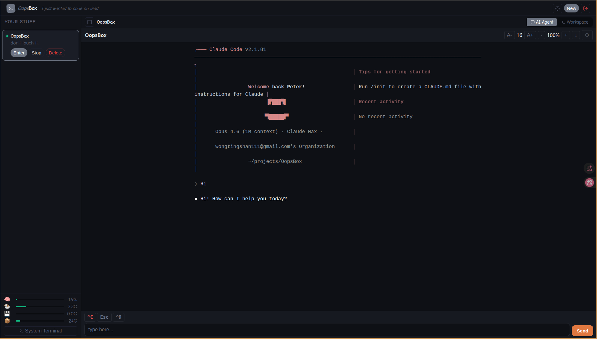
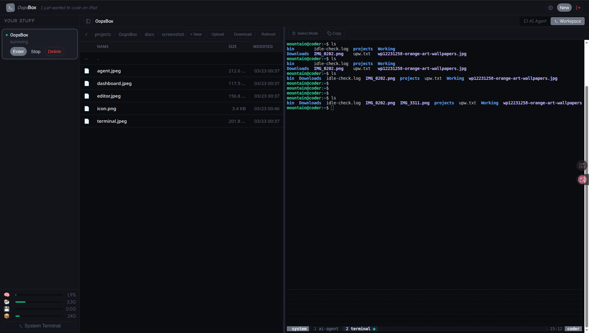

# 📦 OopsBox

[English](#english) | [繁體中文](#繁體中文)

<p align="center">
  
</p>

<p align="center">
  <em>I just wanted to code on iPad. Now there's a whole platform. oops.</em>
</p>

<p align="center">
  
</p>

---

## English

I just wanted to code on iPad.

Somehow I ended up building a whole web-based dev platform. It runs AI coding agents, manages SSH connections, edits files, monitors your server — all from a browser.

It wasn't planned. It just... happened. And it kinda works? So here you go.

### what even is this

A web dashboard that lets you run AI coding agents (Claude Code, Codex, whatever) on a remote server and control them from your iPad, phone, or any browser. You get a terminal, a file manager, an AI agent chat, a code editor, Telegram bot integration, and system monitoring — because once you start adding features, you can't stop. I've tried.

Think of it as a toy that accidentally became useful. Then accidentally grew Telegram legs.

### screenshots

| AI Agent | Workspace |
|:---:|:---:|
|  |  |

| Editor | Dashboard |
|:---:|:---:|
|  |  |

### the accidental feature list

- **AI Agent chat** — talk to your coding agent without fighting with terminal IME on iPad. auto-restart loop keeps it running. now with quick slash command buttons (/compact, /clear, /model...) because typing on iPad is pain.
- **Web terminal** — ttyd + tmux, dynamically resizes to your browser window. per-project sessions. copy button because tmux mouse mode hates iPad.
- **Workspace** — file manager + terminal in tab view. click a file, modal editor pops up. close it, back to browsing. simple like it should be.
- **Code editor** — syntax highlighting, Markdown preview with Mermaid, file upload/download, image preview. opens as a modal because we don't need another VS Code.
- **Telegram Channels** — connect Claude Code to Telegram via `--channels`. your AI agent becomes a Telegram bot. because apparently coding from iPad wasn't enough, now I'm coding from Telegram. what's next, coding from a fridge?
- **SSH remote projects** — your agent runs here, executes commands over there. editor uses SFTP.
- **Project settings** — edit SSH credentials, toggle skip-permissions, session naming. you know, things I should have added from the start.
- **System monitor** — CPU, RAM, swap, disk — because watching CPU go brrr is oddly satisfying
- **Login auth** — hashed password storage, session tokens, HTTP-only cookies
- **Idle auto-shutdown** — projects idle for 30 minutes get stopped automatically
- **PWA support** — add to home screen for an app-like experience
- **Self-deprecating UI** — status messages like "somehow alive" and "don't touch it."
- **Responsive** — works on phone, iPad, desktop. clamp() everywhere. the CSS is a war crime but it works.

### quick start

```bash
git clone <repo-url> OopsBox
cd OopsBox
./install.sh
```

The installer will prompt you to set up login credentials and git config, then install everything.

Then open `http://<your-ip>/` and oops, you have a platform.

#### you'll need

- Ubuntu 24.04 (probably works on other things, haven't tried, good luck)
- Python 3.12+
- An AI coding agent CLI (Claude Code, Codex, etc.)
- An API key for said agent

#### what it installs

```
System:  tmux, ttyd, nginx, jq, sshpass, git
Python:  fastapi, uvicorn, paramiko, python-multipart, aiofiles
```

#### tested on

**Server:**

| Environment | Status |
|---|---|
| Ubuntu 24.04 LTS (x86_64) | ✅ works |
| Debian 12 | 🤷 probably works |
| Proxmox VM | ✅ works |
| Bare metal | ✅ works |
| Docker | 🔜 planned |
| LXC | 🤷 untested |

**Client:**

| Device / Browser | Status |
|---|---|
| iPad Safari | ✅ works (the whole point) |
| iPhone Safari | ✅ mostly works |
| Chrome | ✅ works |
| Firefox | ✅ works |

### how it works (roughly)

```
browser → nginx → FastAPI dashboard
                → ttyd terminals (per project)
                → system terminal

each project gets:
  tmux session
  ├── ai-agent window (hidden, runs your coding agent in auto-restart loop)
  └── terminal window (visible via ttyd, resizes to your browser)

each channel gets:
  tmux session
  └── claude window (runs claude --channels plugin:telegram@...)
```

The AI Agent tab reads the agent's tmux output and shows it in a nicer view with slash command buttons and an input bar that actually works on iPad. The Workspace tab has a file manager and terminal you can switch between. Click a file → modal editor opens. Done editing → close it. No tabs, no complexity, no existential crisis.

### project types

**Local** — agent runs on the box, has full access, does its thing

**SSH** — connects to a remote server. agent stays here, runs commands over SSH. CLAUDE.md tells it how. editor uses SFTP. it works better than it should.

### channels (the "why did I add this" feature)

Channels let your Claude Code instance become a Telegram bot. You chat with it on Telegram, it codes on your server. From the dashboard, click `+ Channel`, paste your BotFather token, and start it. Claude will auto-configure the Telegram plugin, you pair with a code, and boom — you're coding from Telegram on a bus.

The channel runs in its own tmux session with `--dangerously-skip-permissions` because there's no UI to click "allow" on Telegram. Yes, it's called "dangerously" for a reason. No, I don't want to talk about it.

### FAQ

**Q: Is this production ready?**
A: lol no

**Q: Should I use this?**
A: honestly? maybe. it works for me.

**Q: Why does the UI say "somehow alive"?**
A: because that's how I feel about this project

**Q: Why is the icon a Minecraft box?**
A: because it's a box. that you open. and stuff comes out. oops.

**Q: Can I code from Telegram now?**
A: yes. I'm sorry.

**Q: What's next, coding from a toaster?**
A: don't give me ideas.

### license

MIT — do whatever you want with it. if it breaks, that's on you. I just wanted to code on iPad.

---

## 繁體中文

我只是想在 iPad 上寫 code。

結果意外地做出了一整個網頁開發平台。可以跑 AI coding agent、管 SSH 連線、編輯檔案、監控伺服器 — 全部在瀏覽器裡搞定。

這不在計劃中。就是... 莫名其妙變成這樣了。然後它居然能用？那就分享給大家吧。

### 這到底是什麼

一個網頁 dashboard，讓你在遠端 server 上跑 AI coding agent（Claude Code、Codex 之類的），然後用 iPad、手機或任何瀏覽器操控它。你會得到一個 terminal、檔案管理器、AI agent 對話介面、code editor、Telegram bot 整合，還有系統監控 — 因為一旦開始加功能就停不下來。我試過了。

就當作一個意外變得能用的玩具吧。然後它意外長出了 Telegram 的腿。

### 截圖

| AI Agent | Workspace |
|:---:|:---:|
|  |  |

| Editor | Dashboard |
|:---:|:---:|
|  |  |

### 意外產生的功能

- **AI Agent 對話** — 在 iPad 上跟你的 coding agent 講話，不用跟 terminal 的輸入法打架。自動重啟循環讓它持續運作。現在還有快捷按鈕（/compact、/clear、/model...），因為在 iPad 上打字是一種修行。
- **Web terminal** — ttyd + tmux，會根據瀏覽器視窗大小自動調整。每個專案獨立 session。有 Copy 按鈕，因為 tmux 滑鼠模式跟 iPad 是世仇。
- **Workspace** — 檔案管理器 + terminal 用 tab 切換。點檔案跳出編輯器，改完關掉。簡單得像它本來就該這樣。
- **Code editor** — 語法高亮、Markdown 預覽支援 Mermaid、檔案上傳下載、圖片預覽。用 modal 打開，因為這世界不需要又一個 VS Code。
- **Telegram Channels** — 透過 `--channels` 把 Claude Code 接上 Telegram。你的 AI agent 變成 Telegram bot。在 iPad 上寫 code 還不夠，現在連 Telegram 都能寫了。下一步是什麼，用冰箱寫 code？
- **SSH 遠端專案** — agent 在這台跑，指令在那台執行。editor 用 SFTP。
- **專案設定** — 編輯 SSH 憑證、切換跳過權限確認、session 命名。就是那些我一開始就該加的東西。
- **系統監控** — CPU、RAM、swap、磁碟 — 因為看 CPU 跑起來莫名療癒
- **登入驗證** — 雜湊密碼儲存、session token、HTTP-only cookies
- **閒置自動停止** — 閒置超過 30 分鐘的專案會自動停止
- **PWA 支援** — 加到主畫面，像 app 一樣使用
- **自嘲 UI** — 狀態訊息像是「不知怎麼還活著」和「別碰它。」
- **自適應介面** — 手機、iPad、桌機都行。到處都是 clamp()。CSS 是一場戰爭犯罪但它能用。

### 快速開始

```bash
git clone <repo-url> OopsBox
cd OopsBox
./install.sh
```

安裝程式會提示你設定登入帳密和 git 設定，然後自動安裝所有東西。

然後打開 `http://<你的IP>/`，oops，你有一個平台了。

#### 你需要

- Ubuntu 24.04（其他的大概也行，沒試過，祝你好運）
- Python 3.12+
- 一個 AI coding agent CLI（Claude Code、Codex 等）
- 對應的 API key

#### 會裝什麼

```
系統套件：tmux, ttyd, nginx, jq, sshpass, git
Python：  fastapi, uvicorn, paramiko, python-multipart, aiofiles
```

#### 測試過的平台

**Server：**

| 環境 | 狀態 |
|---|---|
| Ubuntu 24.04 LTS (x86_64) | ✅ 能用 |
| Debian 12 | 🤷 大概能用 |
| Proxmox VM | ✅ 能用 |
| 實體機 | ✅ 能用 |
| Docker | 🔜 規劃中 |
| LXC | 🤷 沒測過 |

**Client：**

| 裝置 / 瀏覽器 | 狀態 |
|---|---|
| iPad Safari | ✅ 能用（重點就是這個） |
| iPhone Safari | ✅ 大致能用 |
| Chrome | ✅ 能用 |
| Firefox | ✅ 能用 |

### 大概怎麼運作的

```
瀏覽器 → nginx → FastAPI dashboard
               → ttyd terminal（每個專案一個）
               → 系統 terminal

每個專案會有：
  tmux session
  ├── ai-agent 視窗（隱藏的，用自動重啟循環跑你的 coding agent）
  └── terminal 視窗（看得到的，一般 shell）
```

AI Agent 分頁讀取 agent 的 tmux 輸出，用比較好看的方式顯示，有 slash command 快捷按鈕和輸入框，在 iPad 上打字完全沒問題。Workspace 分頁有檔案管理器和 terminal 可以切換。點檔案 → modal 編輯器打開。改完 → 關掉。沒有 tab 系統，沒有複雜度，沒有存在危機。

### 專案類型

**本機** — agent 在這台機器上跑，有完整存取權

**SSH 遠端** — 連到遠端 server。agent 留在這裡，透過 SSH 執行指令。CLAUDE.md 會教它怎麼做。editor 用 SFTP。運作得比它應該有的還好。

### Channels（「我為什麼要加這個」功能）

Channel 讓你的 Claude Code 變成 Telegram bot。你在 Telegram 上聊天，它在 server 上寫 code。從 dashboard 按 `+ Channel`，貼上 BotFather 的 token，啟動。Claude 會自動設定 Telegram plugin，你用配對碼連上，然後 — 你就在公車上用 Telegram 寫 code 了。

Channel 跑在自己的 tmux session，帶著 `--dangerously-skip-permissions`，因為 Telegram 上沒有地方讓你按「允許」。對，它叫「dangerously」是有原因的。不，我不想談這件事。

### 常見問題

**問：這能上 production 嗎？**
答：你認真？

**問：我該用這個嗎？**
答：說真的？也許吧。反正我自己在用。

**問：為什麼 UI 上寫「不知怎麼還活著」？**
答：因為我對這個專案的感覺就是這樣

**問：為什麼 icon 是 Minecraft 的箱子？**
答：因為它是個箱子。你把它打開。東西掉出來。oops。

**問：現在可以用 Telegram 寫 code 了？**
答：對。我很抱歉。

**問：下一步是什麼，用烤麵包機寫 code？**
答：別給我靈感。

### 授權

MIT — 愛怎麼用就怎麼用。壞了不關我事。我只是想在 iPad 上寫 code。
