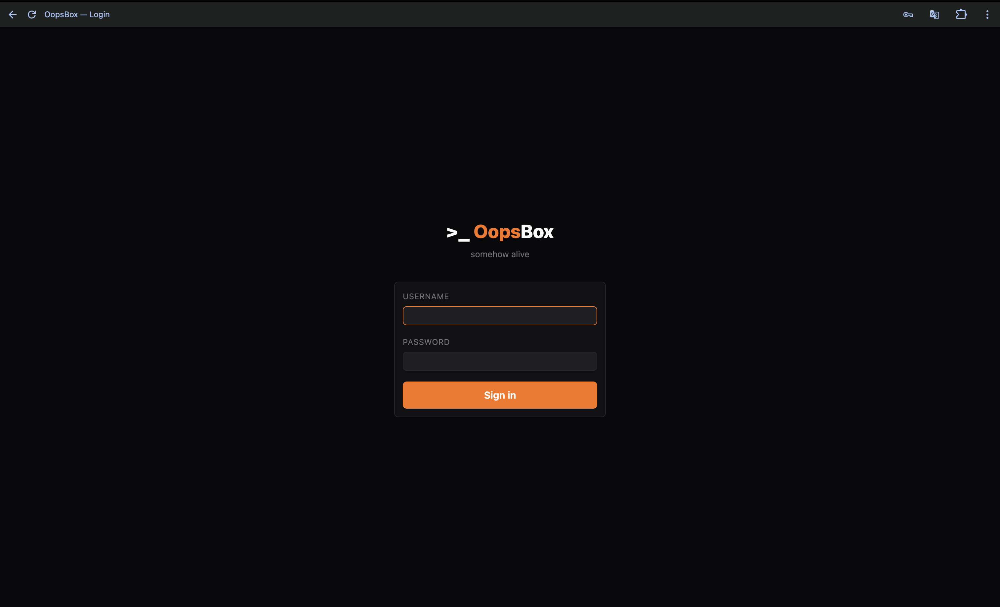
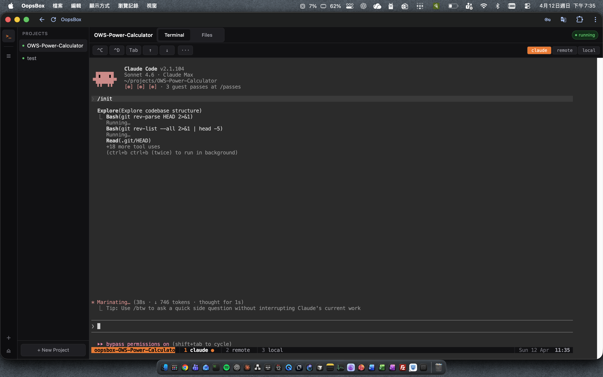
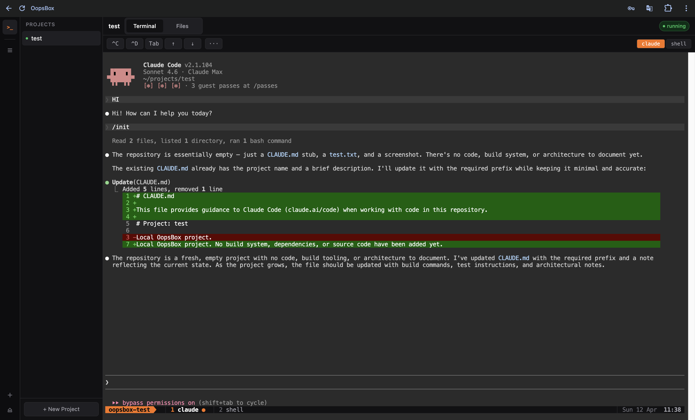

# >_ OopsBox v2

[English](#english) | [繁體中文](#繁體中文)

<p align="center">
  <em>A browser-based platform for running AI coding agents on a remote server. Works on iPad. Started as a weekend project. Still going.</em><br><br>
  <em>在瀏覽器裡操控 AI coding agent 的平台。支援 iPad。本來是個週末專案。還在繼續。</em>
</p>

---

## English

I wanted to code on my iPad — no local IDE, no VPN, just a browser. That turned into a web-based dev platform. v1 had AI chat, Telegram bots, encrypted token storage, and s6-overlay managing 14 processes. It worked well. It was also getting complicated.

v2 is a focused rebuild: fewer moving parts, cleaner architecture, and everything that actually matters kept intact. One `docker run` and you have a full terminal, a file manager with an editor, and Claude Code running autonomously on your server.

### screenshots

<p align="center">
  <br>
  <em>"somehow alive" — an accurate project description</em>
</p>

<p align="center">
  <br>
  <em>An SSH remote project. Claude runs inside the container but every command executes on the remote server. The claude / remote / local buttons switch tmux windows directly from the browser — no prefix key required.</em>
</p>

<p align="center">
  <br>
  <em>Claude reviewing a diff. You read it this time. Probably.</em>
</p>

### what is this

A Docker container with a web dashboard for managing AI coding agents. The core loop: open browser → get a terminal → run Claude Code → Claude does things → you review and guide.

Each project gets its own isolated tmux session. Claude Code runs inside tmux with `claude-loop.sh` restarting it automatically on exit. ttyd streams that session to your browser as a real terminal. nginx handles auth on every route. The whole stack starts with one command.

For SSH remote projects: Claude runs locally in the container, but a shell wrapper transparently forwards every bash command to the remote server over SSH. Claude operates as if it's on the remote machine — file edits, git operations, tests all run there. You also get a dual-panel file manager with local on the left, remote SFTP on the right, and one-click transfer between them.

### features

**Web terminal**  
ttyd + tmux, one isolated session per project. The toolbar provides ^C, ^D, ^Z, ^L, Tab, and arrow keys for touchscreen use. Window tab buttons (claude / shell for local; claude / remote / local for SSH) switch between tmux windows from the browser. The active tab stays in sync with actual tmux state — keyboard shortcuts inside the terminal are reflected in the UI. tmux mouse mode is off so browser text selection and copy-paste work normally.

**File manager**  
Browse, upload, download, rename, delete, create files and folders. Breadcrumb navigation with file type icons. For SSH projects: dual-panel view with local and remote SFTP side by side, plus → / ← transfer buttons. Refresh button to sync the view after external changes.

**File viewer and editor**  
Click any file to open it. Code and text files open in Monaco Editor (the VS Code editor). Markdown renders as HTML with a Source/Preview toggle. Images display inline. PDFs open in the browser. Ctrl+S saves. The folder view refreshes automatically after saving.

**Project management**  
Create local projects (git init, CLAUDE.md, ready) or SSH remote projects (host, user, remote path, password or SSH key path). Credentials are stored in the project registry and used for both the terminal session and SFTP access. Start, stop, and delete projects from the dashboard. Files are not deleted when you remove a project from the registry.

**PWA**  
Installable on iOS and Android. Works as a full-screen app from your home screen. The UI shell loads offline; the terminal needs the server.

**Settings**  
Change username, password, Anthropic API key, base URL, git identity, and SSL paths from the web UI — click ⚙ in the sidebar. No need to restart the container for credential changes.

**Auth**  
PBKDF2-SHA256 with 600,000 iterations, session cookies, nginx `auth_request` on every protected route. Auto-generates a password on first boot if you don't set one — printed once to docker logs, stored hashed.

**System stats**  
CPU, RAM, and disk usage in the nav bar, updated every 5 seconds.

### quick start

```bash
docker run -d \
  --name oopsbox \
  -p 8080:80 \
  -e OOPSBOX_PASSWORD=yourpassword \
  -e GIT_NAME="Your Name" \
  -e GIT_EMAIL="you@example.com" \
  -v oopsbox-projects:/oopsbox/projects \
  -v oopsbox-config:/oopsbox/.config/oopsbox \
  -v oopsbox-claude:/oopsbox/.claude \
  oopsbox
```

Open `http://localhost:8080`, log in, create a project, and start it.

If you skip `OOPSBOX_PASSWORD`, a password is auto-generated and printed to `docker logs oopsbox` — once. Check it before you need it.

| Environment Variable | Default | Description |
|---|---|---|
| `OOPSBOX_PASSWORD` | auto-generated | Dashboard login password |
| `OOPSBOX_USERNAME` | `admin` | Dashboard login username |
| `ANTHROPIC_API_KEY` | — | Anthropic API key for Claude |
| `GIT_NAME` | — | Git author name |
| `GIT_EMAIL` | — | Git author email |
| `SSL_CERT` | — | Path to SSL cert (inside container) |
| `SSL_KEY` | — | Path to SSL key (inside container) |

| Volume | Container Path | Contents |
|---|---|---|
| `oopsbox-projects` | `/oopsbox/projects` | Project files and registry |
| `oopsbox-config` | `/oopsbox/.config/oopsbox` | Auth credentials, encryption keys |
| `oopsbox-claude` | `/oopsbox/.claude` | Claude CLI sessions and settings |

Or mount a `config.yaml` at `/oopsbox/config.yaml`:

```yaml
auth:
  username: admin
  password: yourpassword
git:
  name: Your Name
  email: you@example.com
ssl:
  cert: /path/to/cert.pem
  key: /path/to/key.pem
```

### how it works

```
browser → nginx (auth_request on every protected route)
        → FastAPI / uvicorn (auth, projects, files, ssh, system)
        → ttyd per project (proxied at /terminal/<project>/)

per-project isolated tmux sessions:
  oopsbox-myproject               ← local project
  ├── claude  (claude-loop.sh, auto-restarts on exit)
  └── shell   (plain bash)

  oopsbox-remote-project          ← SSH remote project
  ├── claude  (runs locally; SHELL=remote-bash forwards all commands via SSH)
  ├── remote  (interactive SSH session on the remote server)
  └── local   (plain bash for local config)

supervisord manages:
  - nginx
  - uvicorn (port 5000)
```

For SSH projects, Claude's bash tool is intercepted by a generated `remote-bash` wrapper that forwards every command to the remote server over SSH. The file manager uses paramiko SFTP to browse and transfer files on both sides independently.

### project types

**Local** — code lives inside the container. Start the project and you get a tmux session with Claude in one window and a plain shell in another.

**SSH remote** — point it at any server with SSH access. Claude runs in the container but all its actions execute on the remote machine. Useful for codebases on Proxmox VMs, VPS instances, or homelab servers. Supports password and SSH key authentication.

### tested on

| Environment | Status |
|---|---|
| Docker on Ubuntu 24.04 | ✅ |
| Docker on Debian 12 | 🤷 probably |
| Proxmox VM | ✅ |

| Device | Status |
|---|---|
| iPad Safari | ✅ (the whole point) |
| iPhone Safari | ✅ |
| Chrome | ✅ |
| Firefox | ✅ |

### FAQ

**Q: Where did the AI chat go?**  
A: Removed in v2 to simplify the architecture. The terminal with Claude Code covers the same ground with more control.

**Q: Where did Telegram go?**  
A: Same. Out of scope for v2.

**Q: Where's the code editor?**  
A: In the file viewer — click any file and Monaco Editor opens. It never really left.

**Q: Is this production ready?**  
A: It's stable and I use it daily. Whether that meets your production bar is a personal decision.

**Q: What's next?**  
A: Unknown. The roadmap is short and the ideas list is long.

### license

MIT. Do whatever you want with it. If you find it useful, a star is always appreciated.

---

## 繁體中文

想在 iPad 上寫 code — 不用本地 IDE，不用 VPN，只要一個瀏覽器。這個想法變成了一個 web-based 開發平台。v1 有 AI 對話、Telegram bot、加密 token 儲存、s6-overlay 管 14 個 process，功能完整，但也越來越複雜。

v2 是一次有針對性的重寫：減少複雜度，架構更清晰，保留真正重要的部分。一個 `docker run` 就有完整的 terminal、帶編輯器的檔案管理器、以及在遠端 server 自主作業的 Claude Code。

### 截圖

<p align="center">
  <br>
  <em>"somehow alive" — 精準的專案描述</em>
</p>

<p align="center">
  <br>
  <em>SSH 遠端專案。Claude 在 container 裡跑，但每個指令都在遠端 server 執行。右上角的按鈕直接從瀏覽器切換 tmux 視窗，不需要記任何快捷鍵。</em>
</p>

<p align="center">
  <br>
  <em>Claude 在做 diff。這次你有認真看。大概。</em>
</p>

### 這是什麼

一個 Docker container，提供 web dashboard 讓你管理 AI coding agent。核心流程：打開瀏覽器 → 有 terminal → 跑 Claude Code → Claude 做事 → 你審查和引導。

每個專案有獨立的 tmux session。Claude Code 在 tmux 裡跑，`claude-loop.sh` 會在它退出時自動重啟。ttyd 把 tmux session 串流成瀏覽器裡的真實 terminal。nginx 在最前面處理所有路由的認證。整個架構一個指令就啟動。

SSH 遠端專案：Claude 在 container 本地跑，但一個 shell wrapper 會把它執行的每個 bash 指令透明地透過 SSH 轉發到遠端執行。Claude 的檔案編輯、git 操作、測試全都在遠端跑。還有一個雙面板檔案管理器，左邊本地、右邊遠端 SFTP，一鍵互傳。

### 功能

**Web Terminal**  
ttyd + tmux，每個專案獨立 session。Toolbar 提供 ^C、^D、^Z、^L、Tab、方向鍵，方便觸控螢幕使用。視窗切換按鈕（本機：claude / shell；SSH：claude / remote / local）從瀏覽器直接切換 tmux 視窗，不需要記 prefix。按鈕 active 狀態與 tmux 實際視窗同步。tmux mouse mode 已關閉，瀏覽器文字選取和複製貼上正常運作。

**檔案管理器**  
瀏覽、上傳、下載、重命名、刪除、建立檔案和資料夾。麵包屑導航，副檔名圖示。SSH 專案有雙面板：左邊本地、右邊遠端 SFTP，→ / ← 按鈕一鍵互傳。重新整理按鈕同步資料夾最新狀態。

**檔案檢視器與編輯器**  
點一下檔案就開啟。程式碼和文字檔用 Monaco Editor（VS Code 的編輯器）開啟。Markdown 渲染成 HTML，有 Source / Preview 切換。圖片直接顯示，PDF 在瀏覽器裡開。Ctrl+S 儲存，儲存後自動刷新資料夾。

**專案管理**  
建立本機專案（git init、CLAUDE.md、完成）或 SSH 遠端專案（填入 host、帳號、遠端路徑，以及密碼或 SSH 金鑰路徑）。憑證儲存在 project registry，terminal 連線和 SFTP 存取共用。從 dashboard 啟動、停止、刪除專案。從 registry 移除專案不會刪除檔案。

**PWA**  
可安裝到 iOS 和 Android 主畫面，以全螢幕 app 模式開啟。UI shell 可離線載入；terminal 需要 server 連線。

**設定頁面**  
從 web UI 修改帳號密碼、Anthropic API key、base URL、git 身份、SSL 路徑——點左側欄的 ⚙。憑證變更即時生效，不需要重啟 container。

**認證**  
PBKDF2-SHA256 600,000 次迭代、session cookie、nginx `auth_request` 在每個受保護路由。第一次啟動若未設定密碼則自動產生，印一次到 docker logs，之後以雜湊儲存。

**系統監控**  
CPU、RAM、磁碟用量在 nav bar，每 5 秒更新。

### 快速開始

```bash
docker run -d \
  --name oopsbox \
  -p 8080:80 \
  -e OOPSBOX_PASSWORD=你的密碼 \
  -e GIT_NAME="你的名字" \
  -e GIT_EMAIL="you@example.com" \
  -v oopsbox-projects:/oopsbox/projects \
  -v oopsbox-config:/oopsbox/.config/oopsbox \
  -v oopsbox-claude:/oopsbox/.claude \
  oopsbox
```

打開 `http://localhost:8080`，登入，建立專案，啟動。

沒設 `OOPSBOX_PASSWORD` 的話，密碼自動產生並印在 `docker logs oopsbox` 裡——只印一次。

| 環境變數 | 預設值 | 說明 |
|---|---|---|
| `OOPSBOX_PASSWORD` | 自動產生 | Dashboard 登入密碼 |
| `OOPSBOX_USERNAME` | `admin` | Dashboard 登入帳號 |
| `ANTHROPIC_API_KEY` | — | Claude 的 Anthropic API key |
| `GIT_NAME` | — | Git 作者名稱 |
| `GIT_EMAIL` | — | Git 作者信箱 |
| `SSL_CERT` | — | SSL 憑證路徑（container 內） |
| `SSL_KEY` | — | SSL 金鑰路徑（container 內） |

| Volume | 容器路徑 | 內容 |
|---|---|---|
| `oopsbox-projects` | `/oopsbox/projects` | 專案檔案和 registry |
| `oopsbox-config` | `/oopsbox/.config/oopsbox` | 認證資訊、加密金鑰 |
| `oopsbox-claude` | `/oopsbox/.claude` | Claude CLI session 和設定 |

或者掛 `config.yaml` 到 `/oopsbox/config.yaml`：

```yaml
auth:
  username: admin
  password: 你的密碼
git:
  name: 你的名字
  email: you@example.com
ssl:
  cert: /path/to/cert.pem
  key: /path/to/key.pem
```

### 大概怎麼運作的

```
瀏覽器 → nginx（每個受保護路由都走 auth_request）
        → FastAPI / uvicorn（auth、projects、files、ssh、system）
        → 每個專案一個 ttyd（代理在 /terminal/<project>/）

每個專案獨立的 tmux session：
  oopsbox-myproject               ← 本機專案
  ├── claude  （claude-loop.sh，退出自動重啟）
  └── shell   （純 bash）

  oopsbox-remote-project          ← SSH 遠端專案
  ├── claude  （本地跑；SHELL=remote-bash 把所有指令透過 SSH 轉發）
  ├── remote  （遠端 server 的互動式 SSH session）
  └── local   （本地 bash）

supervisord 管的：
  - nginx
  - uvicorn（port 5000）
```

SSH 專案中，Claude 的 bash tool 被生成的 `remote-bash` wrapper 攔截，把每個指令透過 SSH 轉發到遠端執行。檔案管理器用 paramiko SFTP 獨立瀏覽兩側的檔案，並可互傳。

### 專案類型

**本機** — code 在 container 內。啟動就得到一個 tmux session，claude 在一個視窗、純 shell 在另一個。

**SSH 遠端** — 指向任何有 SSH 存取的 server。Claude 在 container 裡跑，所有動作在遠端執行。適合 codebase 在 Proxmox VM、VPS 或 homelab 的情況。支援密碼和 SSH 金鑰認證。

### 測試過的平台

| 環境 | 狀態 |
|---|---|
| Docker on Ubuntu 24.04 | ✅ |
| Docker on Debian 12 | 🤷 大概行 |
| Proxmox VM | ✅ |

| 裝置 | 狀態 |
|---|---|
| iPad Safari | ✅（重點就是這個） |
| iPhone Safari | ✅ |
| Chrome | ✅ |
| Firefox | ✅ |

### 常見問題

**問：AI 對話去哪了？**  
答：v2 為了簡化架構移除了。Claude Code 在 terminal 裡可以做到更多。

**問：Telegram 呢？**  
答：也移除了。不在 v2 的範圍內。

**問：Code editor 呢？**  
答：在檔案檢視器裡——點任何檔案，Monaco Editor 就開了。

**問：這能上 production 嗎？**  
答：穩定，我每天在用。適不適合你的環境由你判斷。

**問：下一步是什麼？**  
答：還不確定。有想法的話歡迎開 issue。

### 授權

MIT。隨意使用。如果有幫助的話，歡迎給個 star。
