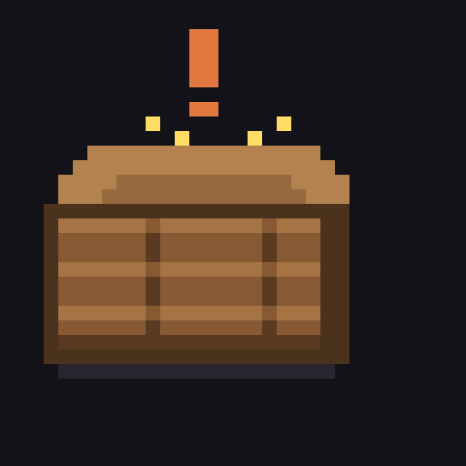
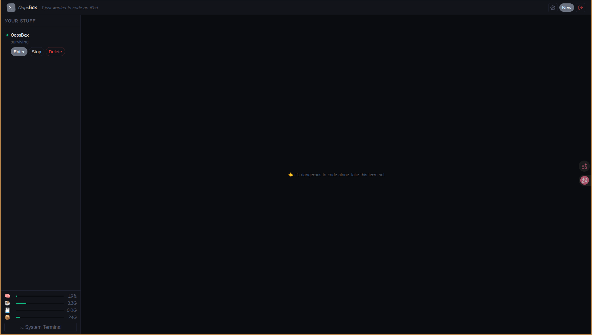
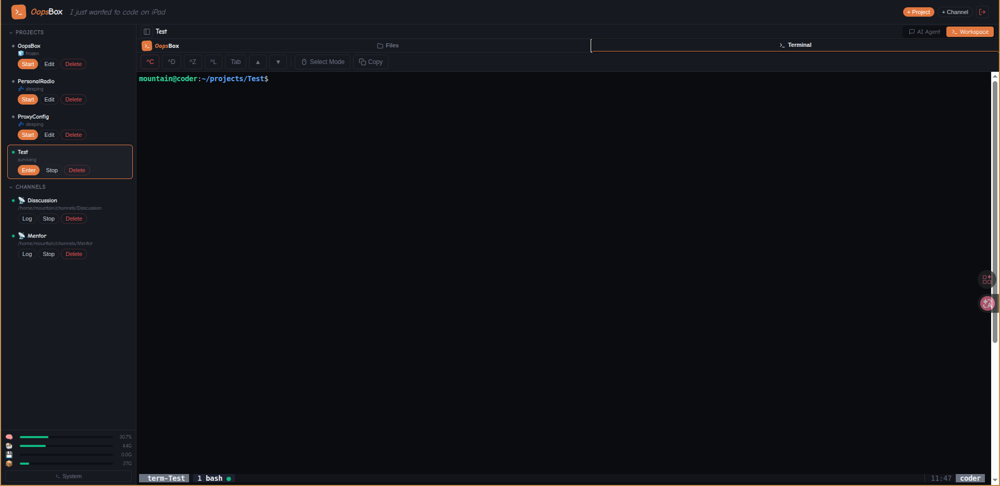
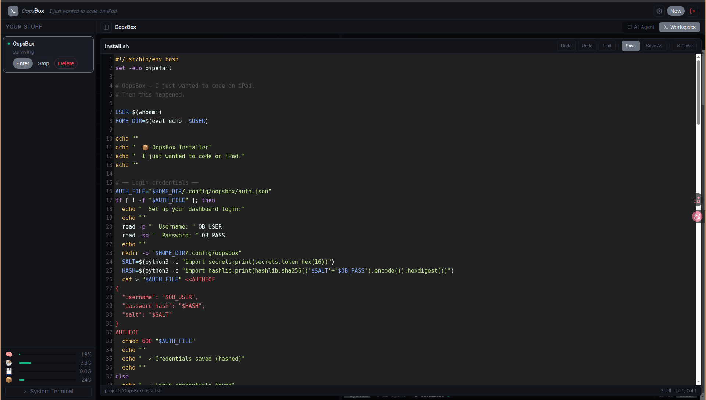

# 📦 OopsBox

[English](#english) | [繁體中文](#繁體中文)

<p align="center">
  
</p>

<p align="center">
  <em>I just wanted to code on iPad. Now there's a whole platform. oops.</em>
</p>

<!-- screenshots - add your own! -->
<p align="center">
  
</p>

---

## English

I just wanted to code on iPad.

Somehow I ended up building a whole web-based dev platform. It runs AI coding agents, manages SSH connections, edits files, monitors your server — all from a browser.

It wasn't planned. It just... happened. And it kinda works? So here you go.

### what even is this

A web dashboard that lets you run AI coding agents (Claude, Codex, whatever) on a remote server and control them from your iPad, phone, or any browser. You get a terminal, a chat view for your AI agent, a code editor, and some system monitoring stuff thrown in because why not.

Think of it as a toy that accidentally became useful.

### screenshots

| AI Agent | Terminal | Editor |
|:---:|:---:|:---:|
|  |  |  |

<!-- mobile screenshot -->
<details>
<summary>📱 iPad / Mobile</summary>
<p align="center">
  
</p>
</details>

### the accidental feature list

- **AI Agent chat** — talk to your coding agent without fighting with terminal IME on iPad
- **Web terminal** — ttyd + tmux, for when you actually need a real shell
- **Code editor** — syntax highlighting, Markdown preview with Mermaid, file upload/download
- **SSH remote projects** — your agent runs here, executes commands over there
- **System monitor** — because watching CPU go brrr is oddly satisfying
- **Self-deprecating UI** — status messages like "somehow alive" and "don't touch it."
- **Mobile friendly** — works on phone, iPad, desktop. mostly.

### quick start

```bash
git clone <repo-url> OopsBox
cd OopsBox
./install.sh
```

Then open `http://<your-ip>/` and oops, you have a platform.

#### you'll need

- Ubuntu 24.04 (probably works on other things, haven't tried, good luck)
- Node.js 22+
- Python 3.12+
- An AI coding agent CLI (Claude Code, Codex, etc.)
- An API key for said agent

#### what it installs

```
System:  tmux, ttyd, nginx, jq, sshpass
Python:  fastapi, uvicorn, paramiko, python-multipart, aiofiles
```

#### tested on

**Server OS:**

| OS | Status |
|---|---|
| Ubuntu 24.04 LTS (x86_64) | ✅ works |
| Debian 12 | 🤷 probably works |
| Other Linux | 🤷 good luck |

**Client (browser):**

| Device | Browser | Status |
|---|---|---|
| iPad | Safari | ✅ works (the whole point) |
| iPhone | Safari | ✅ mostly works |
| Mac / Linux / Windows | Chrome | ✅ works |
| Mac / Linux / Windows | Firefox | ✅ works |

**Hosting:**

| Environment | Status |
|---|---|
| Proxmox VM | ✅ works |
| Bare metal | ✅ works |
| Docker | 🔜 planned |
| LXC | 🤷 untested |

### how it works (roughly)

```
browser → nginx → FastAPI dashboard
                → ttyd terminals (per project)
                → system terminal

each project gets:
  tmux session
  ├── ai-agent window (hidden, runs your coding agent)
  └── terminal window (visible, regular shell)
```

The AI Agent tab reads the agent's tmux output and shows it in a nicer view with an input bar that actually works on iPad. The Terminal tab is a real terminal for when you need vim or htop or whatever.

### project types

**Local** — agent runs on the box, has full access, does its thing

**SSH** — connects to a remote server. agent stays here, runs commands over SSH. CLAUDE.md tells it how. editor uses SFTP. it works better than it should.

### FAQ

**Q: Is this production ready?**
A: lol no

**Q: Should I use this?**
A: honestly? maybe. it works for me.

**Q: Why does the UI say "somehow alive"?**
A: because that's how I feel about this project

**Q: Why is the icon a Minecraft box?**
A: because it's a box. that you open. and stuff comes out. oops.

### license

MIT — do whatever you want with it. if it breaks, that's on you. I just wanted to code on iPad.

---

## 繁體中文

我只是想在 iPad 上寫 code。

結果意外地做出了一整個網頁開發平台。可以跑 AI coding agent、管 SSH 連線、編輯檔案、監控伺服器 — 全部在瀏覽器裡搞定。

這不在計劃中。就是... 莫名其妙變成這樣了。然後它居然能用？那就分享給大家吧。

### 這到底是什麼

一個網頁 dashboard，讓你在遠端 server 上跑 AI coding agent（Claude、Codex 之類的），然後用 iPad、手機或任何瀏覽器操控它。你會得到一個 terminal、一個跟 AI agent 對話的介面、一個 code editor，還有系統監控 — 反正都做了，多加一個也沒差。

就當作一個意外變得能用的玩具吧。

### 截圖

| AI Agent | Terminal | Editor |
|:---:|:---:|:---:|
|  |  |  |

### 意外產生的功能

- **AI Agent 對話** — 在 iPad 上跟你的 coding agent 講話，不用跟 terminal 的輸入法打架
- **Web terminal** — ttyd + tmux，當你真的需要一個 shell 的時候
- **Code editor** — 語法高亮、Markdown 預覽支援 Mermaid、檔案上傳下載
- **SSH 遠端專案** — agent 在這台跑，指令在那台執行
- **系統監控** — 因為看 CPU 跑起來莫名療癒
- **自嘲 UI** — 狀態訊息像是「不知怎麼還活著」和「別碰它。」
- **手機也能用** — 手機、iPad、桌機都行。大概。

### 快速開始

```bash
git clone <repo-url> OopsBox
cd OopsBox
./install.sh
```

然後打開 `http://<你的IP>/`，oops，你有一個平台了。

#### 你需要

- Ubuntu 24.04（其他的大概也行，沒試過，祝你好運）
- Node.js 22+
- Python 3.12+
- 一個 AI coding agent CLI（Claude Code、Codex 等）
- 對應的 API key

#### 會裝什麼

```
系統套件：tmux, ttyd, nginx, jq, sshpass
Python：  fastapi, uvicorn, paramiko, python-multipart, aiofiles
```

#### 測試過的平台

**Server 作業系統：**

| 作業系統 | 狀態 |
|---|---|
| Ubuntu 24.04 LTS (x86_64) | ✅ 能用 |
| Debian 12 | 🤷 大概能用 |
| 其他 Linux | 🤷 祝你好運 |

**用戶端（瀏覽器）：**

| 裝置 | 瀏覽器 | 狀態 |
|---|---|---|
| iPad | Safari | ✅ 能用（重點就是這個） |
| iPhone | Safari | ✅ 大致能用 |
| Mac / Linux / Windows | Chrome | ✅ 能用 |
| Mac / Linux / Windows | Firefox | ✅ 能用 |

**部署環境：**

| 環境 | 狀態 |
|---|---|
| Proxmox VM | ✅ 能用 |
| 實體機 | ✅ 能用 |
| Docker | 🔜 規劃中 |
| LXC | 🤷 沒測過 |

### 大概怎麼運作的

```
瀏覽器 → nginx → FastAPI dashboard
               → ttyd terminal（每個專案一個）
               → 系統 terminal

每個專案會有：
  tmux session
  ├── ai-agent 視窗（隱藏的，跑你的 coding agent）
  └── terminal 視窗（看得到的，一般 shell）
```

AI Agent 分頁讀取 agent 的 tmux 輸出，用比較好看的方式顯示，底下有個輸入框，在 iPad 上打字完全沒問題。Terminal 分頁是真正的 terminal，要用 vim 或 htop 的時候用。

### 專案類型

**本機** — agent 在這台機器上跑，有完整存取權

**SSH 遠端** — 連到遠端 server。agent 留在這裡，透過 SSH 執行指令。CLAUDE.md 會教它怎麼做。editor 用 SFTP。運作得比它應該有的還好。

### 常見問題

**問：這能上 production 嗎？**
答：你認真？

**問：我該用這個嗎？**
答：說真的？也許吧。反正我自己在用。

**問：為什麼 UI 上寫「不知怎麼還活著」？**
答：因為我對這個專案的感覺就是這樣

**問：為什麼 icon 是 Minecraft 的箱子？**
答：因為它是個箱子。你把它打開。東西掉出來。oops。

### 授權

MIT — 愛怎麼用就怎麼用。壞了不關我事。我只是想在 iPad 上寫 code。
